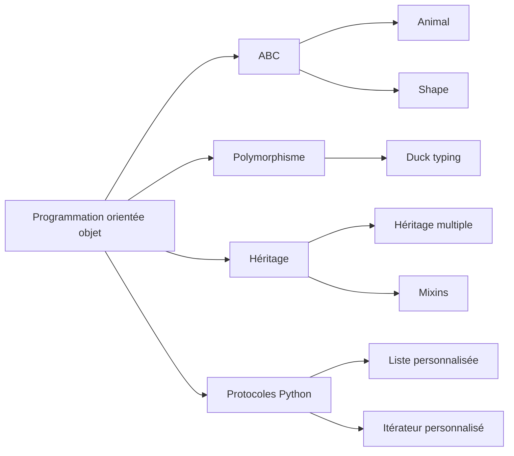

# Python - ABC, duck typing et héritage multiple

Ce dossier regroupe des exercices consacrés aux interfaces et mécanismes avancés de la programmation orientée objet en Python : classes abstraites, duck typing, surcharge de méthodes, protocole d'itération, héritage multiple et mixins.

## Objectifs

- Définir des classes abstraites avec `ABC` et `@abstractmethod`.
- Imposer une interface commune à plusieurs classes concrètes.
- Utiliser le polymorphisme et le duck typing.
- Étendre le comportement de types natifs comme `list`.
- Implémenter le protocole d'itération avec `__iter__` et `__next__`.
- Comprendre l'héritage multiple et les mixins.

## Fichiers

| Fichier | Contenu |
| --- | --- |
| `task_00_abc.py` | Classe abstraite `Animal` et implémentations `Dog` / `Cat` de la méthode `sound()` |
| `task_01_duck_typing.py` | ABC `Shape`, classes `Circle` et `Rectangle`, calcul d'aire et de périmètre via `shape_info()` |
| `task_02_verboselist.py` | Sous-classe `VerboseList` surchargeant `append`, `extend`, `remove` et `pop` |
| `task_03_countediterator.py` | Itérateur enveloppé dans `CountedIterator` avec comptage des éléments parcourus |
| `task_04_flyingfish.py` | Héritage multiple avec `FlyingFish(Fish, Bird)` |
| `task_05_dragon.py` | Composition de comportements avec `SwimMixin`, `FlyMixin` et `Dragon` |

## Schéma des concepts



## Exécution

Les fichiers peuvent être importés depuis des scripts de test ou exécutés avec Python 3 selon l'exercice :

```bash
python3 main_00_abc.py
```

## Technologies

- Python 3
- Module standard `abc`
- Programmation orientée objet
