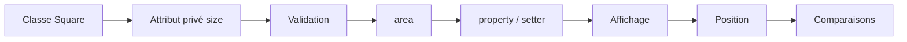

# Python - Classes et objets

Ce dossier regroupe une progression d'exercices autour de la programmation orientée objet en Python. La classe `Square` évolue progressivement pour intégrer encapsulation, validation, propriétés, calculs et surcharge d'opérateurs. Des exercices avancés introduisent également une liste simplement chaînée.

## Objectifs

- Définir et instancier des classes Python.
- Utiliser des attributs privés.
- Valider les données à l'initialisation et via des setters.
- Créer des propriétés avec `@property`.
- Implémenter des méthodes métier comme `area()`.
- Personnaliser l'affichage d'un objet.
- Surcharger des opérateurs de comparaison.
- Manipuler une structure de données chaînée avec des classes.

## Fichiers

| Fichier | Contenu |
| --- | --- |
| `0-square.py` | Première définition de la classe `Square` |
| `1-square.py` | Ajout d'un attribut privé `size` |
| `2-square.py` | Validation du type et de la valeur de `size` |
| `3-square.py` | Calcul de l'aire du carré |
| `4-square.py` | Accès à `size` avec getter et setter |
| `5-square.py` | Représentation textuelle du carré |
| `6-square.py` | Gestion de la position et affichage enrichi |
| `100-singly_linked_list.py` | Implémentation d'une liste simplement chaînée avec `Node` et `SinglyLinkedList` |
| `101-square.py` | Extension des comportements de `Square` |
| `102-square.py` | Comparaison de carrés avec les opérateurs `==`, `!=`, `<`, `<=`, `>` et `>=` |

## Progression de la classe `Square`



## Exécution

Les modules sont conçus pour être importés depuis les fichiers de test correspondants :

```bash
python3 0-main.py
```

## Technologies

- Python 3
- Programmation orientée objet
- Encapsulation et propriétés
- Méthodes spéciales Python
