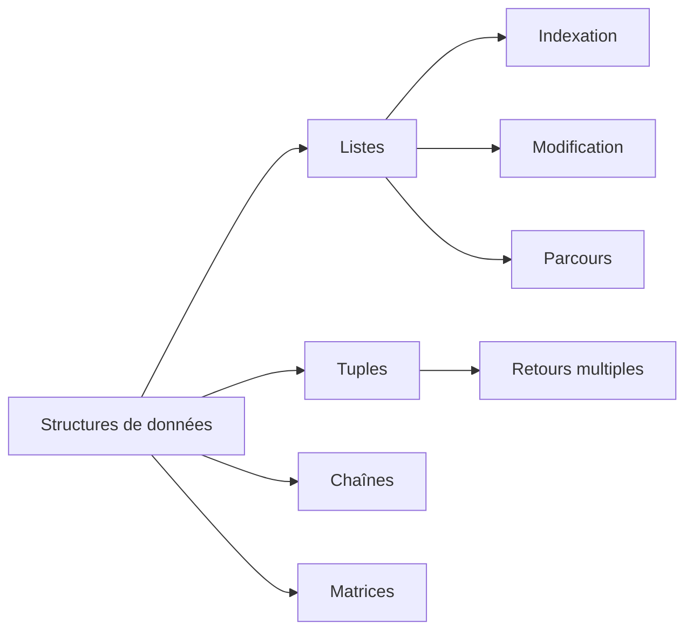

# Python - Structures de données

Ce dossier regroupe des exercices consacrés aux listes et tuples en Python, ainsi qu'aux opérations courantes de lecture, modification, parcours et transformation de collections.

## Objectifs

- Parcourir et afficher le contenu d'une liste.
- Accéder à un élément par son index.
- Remplacer ou supprimer un élément.
- Créer de nouvelles listes sans modifier l'originale.
- Manipuler chaînes, matrices et tuples.
- Utiliser des retours multiples.
- Rechercher une valeur maximale et filtrer des éléments.

## Fichiers

| Fichier | Contenu |
| --- | --- |
| `0-print_list_integer.py` | Affichage des entiers d'une liste |
| `1-element_at.py` | Accès sécurisé à un élément par index |
| `2-replace_in_list.py` | Remplacement d'un élément dans une liste |
| `3-print_reversed_list_integer.py` | Affichage d'une liste en ordre inverse |
| `4-new_in_list.py` | Création d'une copie avec remplacement d'un élément |
| `5-no_c.py` | Suppression des caractères `c` et `C` d'une chaîne |
| `6-print_matrix_integer.py` | Affichage d'une matrice d'entiers |
| `7-add_tuple.py` | Addition élément par élément de deux tuples |
| `8-multiple_returns.py` | Retour de plusieurs informations sur une chaîne |
| `9-max_integer.py` | Recherche du plus grand entier d'une liste |
| `10-divisible_by_2.py` | Détection des éléments divisibles par 2 |
| `11-delete_at.py` | Suppression d'un élément à un index donné |
| `12-switch.py` | Échange de valeurs entre deux variables |

## Concepts abordés



## Exécution

Les fonctions sont principalement importées depuis des fichiers de test :

```bash
python3 0-main.py
```

## Technologies

- Python 3
- Listes et tuples
- Boucles et indexation
- Manipulation de chaînes
