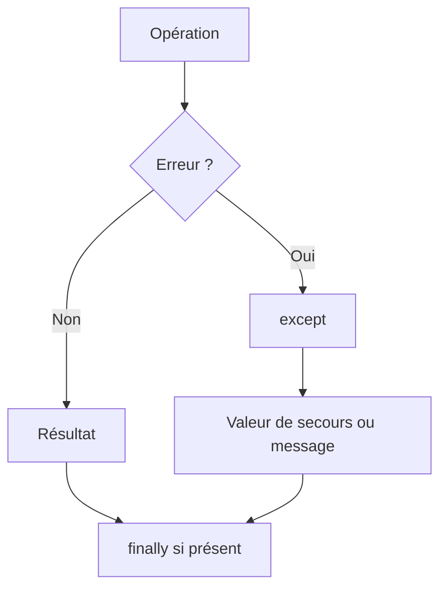

# Python - Exceptions

Ce dossier regroupe des exercices consacrés à la gestion des erreurs et exceptions en Python. Les fonctions montrent comment protéger une opération, gérer plusieurs types d'erreurs, garantir l'exécution d'un bloc avec `finally` et lever volontairement des exceptions.

## Objectifs

- Utiliser `try` / `except` pour intercepter des erreurs.
- Gérer des erreurs de type, d'index ou de division.
- Utiliser `finally` pour exécuter du code dans tous les cas.
- Retourner des informations même lorsqu'une opération échoue.
- Lever explicitement des exceptions avec `raise`.
- Associer un message personnalisé à une exception.

## Fichiers

| Fichier | Contenu |
| --- | --- |
| `0-safe_print_list.py` | Affichage sécurisé d'un nombre donné d'éléments d'une liste |
| `1-safe_print_integer.py` | Affichage sécurisé d'un entier |
| `2-safe_print_list_integers.py` | Affichage des seuls éléments entiers d'une liste |
| `3-safe_print_division.py` | Division protégée avec traitement final |
| `4-list_division.py` | Division élément par élément de deux listes avec gestion des erreurs |
| `5-raise_exception.py` | Levée volontaire d'une `TypeError` |
| `6-raise_exception_msg.py` | Levée d'une exception avec message personnalisé |

## Flux général



## Exécution

```bash
python3 0-main.py
```

## Technologies

- Python 3
- Exceptions
- `try`, `except`, `finally`, `raise`
