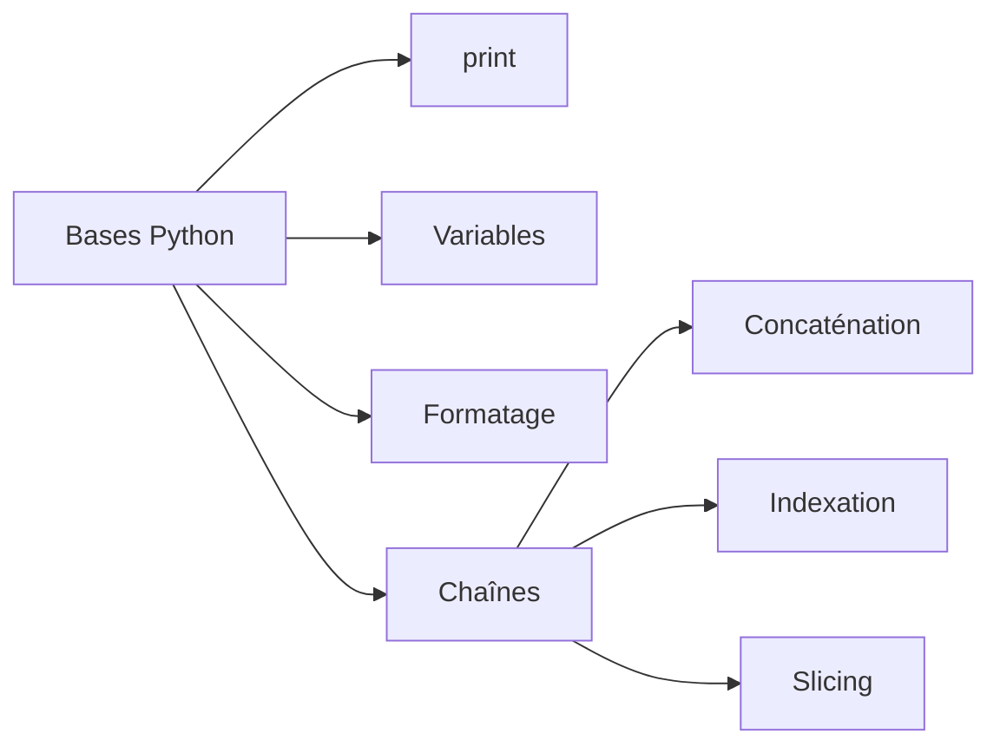

# Python - Hello, World

Ce dossier regroupe les premiers exercices Python du dépôt : affichage, formatage de nombres, manipulation de chaînes, concaténation et slicing.

## Objectifs

- Exécuter des scripts Python 3.
- Afficher du texte et des variables avec `print()`.
- Formater des entiers et des nombres flottants.
- Concaténer et découper des chaînes de caractères.
- Utiliser l'indexation et le slicing.

## Fichiers

| Fichier | Contenu |
| --- | --- |
| `2-print.py` | Affichage d'une phrase avec `print()` |
| `3-print_number.py` | Affichage d'un entier dans une chaîne formatée |
| `4-print_float.py` | Formatage d'un nombre flottant |
| `5-print_string.py` | Répétition et découpage d'une chaîne |
| `6-concat.py` | Concaténation de chaînes |
| `7-edges.py` | Extraction de portions d'une chaîne avec le slicing |
| `8-concat_edges.py` | Construction d'une nouvelle chaîne à partir de plusieurs slices |
| `9-easter_egg.py` | Affichage du Zen of Python |

## Concepts abordés



## Exécution

```bash
python3 2-print.py
```

## Technologies

- Python 3
- Chaînes de caractères
- Formatage et affichage
