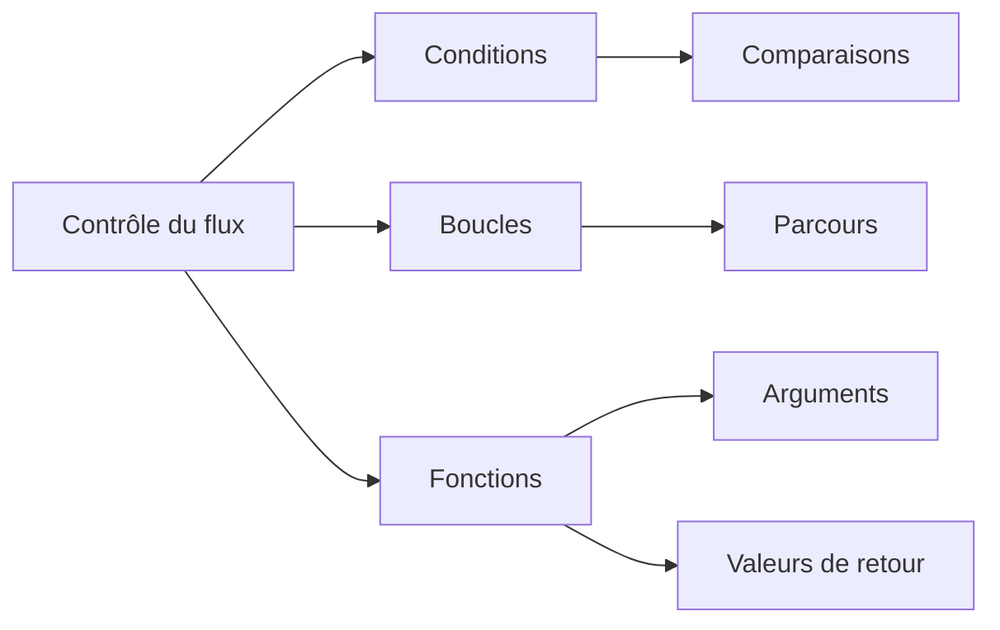

# Python - Conditions, boucles et fonctions

Ce dossier rassemble des exercices fondamentaux sur le contrôle du flux d'exécution en Python : conditions, boucles, manipulation de nombres et premières fonctions.

## Objectifs

- Utiliser `if`, `elif` et `else`.
- Parcourir des séquences avec des boucles.
- Manipuler des caractères et leurs codes.
- Écrire et appeler des fonctions simples.
- Travailler avec les opérateurs arithmétiques et modulo.
- Produire des sorties formatées selon des règles précises.

## Fichiers

| Fichier | Contenu |
| --- | --- |
| `0-positive_or_negative.py` | Classification d'un entier comme positif, négatif ou nul |
| `1-last_digit.py` | Analyse du dernier chiffre d'un entier |
| `2-print_alphabet.py` | Affichage de l'alphabet en minuscules |
| `3-print_alphabt.py` | Affichage de l'alphabet avec exclusions |
| `4-print_hexa.py` | Affichage de nombres en décimal et hexadécimal |
| `5-print_comb2.py` | Combinaisons de nombres à deux chiffres |
| `6-print_comb3.py` | Combinaisons uniques de trois chiffres |
| `7-islower.py` | Fonction testant si un caractère est en minuscule |
| `8-uppercase.py` | Conversion et affichage d'une chaîne en majuscules |
| `9-print_last_digit.py` | Fonction retournant le dernier chiffre d'un entier |
| `10-add.py` | Fonction d'addition de deux entiers |
| `11-pow.py` | Calcul d'une puissance |
| `12-fizzbuzz.py` | Implémentation de FizzBuzz |

## Concepts abordés



## Exécution

```bash
python3 0-positive_or_negative.py
```

## Technologies

- Python 3
- Conditions et boucles
- Fonctions
- Opérations arithmétiques
