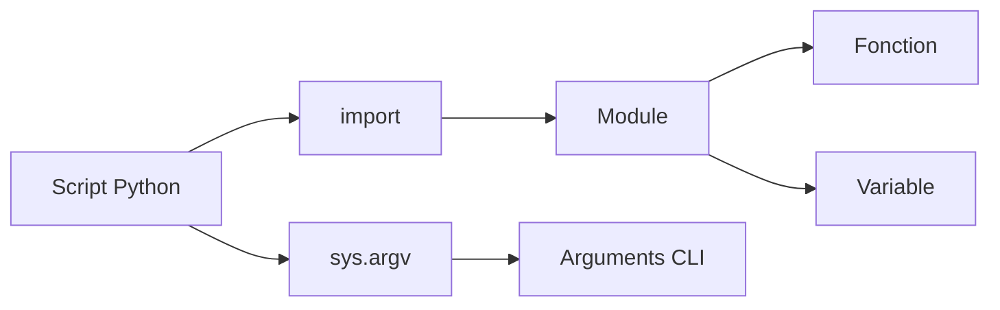

# Python - Imports et modules

Ce dossier regroupe des exercices consacrés à l'organisation du code Python en modules, à l'import de fonctions et variables, ainsi qu'à la lecture des arguments passés en ligne de commande.

## Objectifs

- Importer une fonction depuis un module.
- Importer plusieurs fonctions et les utiliser dans un script.
- Lire les arguments de la ligne de commande avec `sys.argv`.
- Effectuer des calculs à partir d'un nombre variable d'arguments.
- Importer une variable définie dans un autre fichier.
- Protéger le point d'entrée d'un script avec `if __name__ == "__main__"`.

## Fichiers

| Fichier | Contenu |
| --- | --- |
| `0-add.py` | Import et utilisation d'une fonction d'addition |
| `1-calculation.py` | Import de plusieurs opérations arithmétiques |
| `2-args.py` | Affichage du nombre et de la valeur des arguments reçus |
| `3-infinite_add.py` | Addition d'un nombre variable d'arguments |
| `5-variable_load.py` | Import et affichage d'une variable externe |

## Flux d'import



## Exécution

```bash
python3 2-args.py premier second
```

## Technologies

- Python 3
- Modules et imports
- `sys.argv`
- Scripts en ligne de commande
