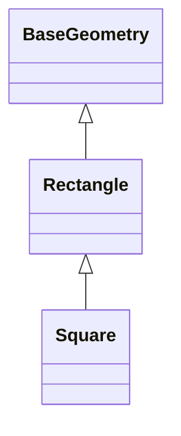

# Python - Héritage

Ce dossier explore l'héritage en Python, l'introspection des classes, les relations entre types et la spécialisation progressive de classes géométriques.

## Objectifs

- Inspecter les attributs et méthodes d'un objet.
- Vérifier le type exact ou la relation d'héritage d'une instance.
- Créer des sous-classes à partir de types natifs.
- Définir une classe de base réutilisable.
- Valider des valeurs dans une hiérarchie de classes.
- Redéfinir des méthodes dans une sous-classe.
- Utiliser les méthodes spéciales pour personnaliser le comportement d'objets.

## Fichiers

| Fichier | Contenu |
| --- | --- |
| `0-lookup.py` | Liste des attributs et méthodes disponibles sur un objet |
| `1-my_list.py` | Sous-classe de `list` avec affichage trié |
| `2-is_same_class.py` | Vérification du type exact d'un objet |
| `3-is_kind_of_class.py` | Vérification avec prise en compte de l'héritage |
| `4-inherits_from.py` | Détection d'un héritage strict |
| `5-base_geometry.py` à `7-base_geometry.py` | Construction progressive de `BaseGeometry` |
| `8-rectangle.py` et `9-rectangle.py` | Classe `Rectangle` héritant de `BaseGeometry` |
| `10-square.py` et `11-square.py` | Classe `Square` dérivée de `Rectangle` |
| `100-my_int.py` | Sous-classe de `int` modifiant le comportement des comparaisons |
| `101-add_attribute.py` | Ajout dynamique d'un attribut lorsque l'objet le permet |

## Hiérarchie géométrique



## Exécution

```bash
python3 0-main.py
```

## Technologies

- Python 3
- Héritage et polymorphisme
- Introspection
- Méthodes spéciales
