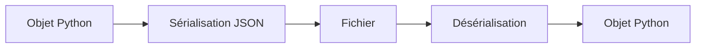

# Python - Entrées / sorties et sérialisation

Ce dossier regroupe des exercices sur la lecture et l'écriture de fichiers, la sérialisation JSON et la conversion d'objets Python en représentations persistables.

## Objectifs

- Lire le contenu d'un fichier texte.
- Écrire ou ajouter du texte dans un fichier.
- Convertir des objets Python vers et depuis JSON.
- Sauvegarder et recharger des données depuis un fichier JSON.
- Sérialiser les attributs d'une instance.
- Filtrer les attributs exportés d'un objet.
- Restaurer l'état d'une instance depuis un dictionnaire.
- Construire une structure algorithmique avec le triangle de Pascal.

## Fichiers

| Fichier | Contenu |
| --- | --- |
| `0-read_file.py` | Lecture et affichage d'un fichier texte |
| `1-write_file.py` | Écriture dans un fichier et retour du nombre de caractères écrits |
| `2-append_write.py` | Ajout de texte à la fin d'un fichier |
| `3-to_json_string.py` | Sérialisation d'un objet vers une chaîne JSON |
| `4-from_json_string.py` | Désérialisation d'une chaîne JSON |
| `5-save_to_json_file.py` | Sauvegarde d'un objet dans un fichier JSON |
| `6-load_from_json_file.py` | Chargement d'un objet depuis un fichier JSON |
| `7-add_item.py` | Persistance d'arguments CLI dans un fichier JSON |
| `8-class_to_json.py` | Conversion des attributs d'une instance en dictionnaire |
| `9-student.py` à `11-student.py` | Sérialisation et restauration progressive d'objets `Student` |
| `12-pascal_triangle.py` | Génération du triangle de Pascal |

## Flux de sérialisation



## Exécution

```bash
python3 0-main.py
```

## Technologies

- Python 3
- Fichiers texte
- Module `json`
- Sérialisation / désérialisation
