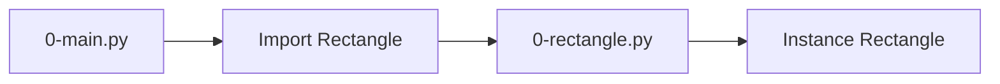

# Python - More Classes

Ce dossier contient une première étape d'approfondissement de la programmation orientée objet avec une classe `Rectangle` minimale.

## Objectifs

- Définir une classe Python simple.
- Instancier un objet depuis un script de test.
- Structurer un module autour d'une classe dédiée.

## Fichiers

| Fichier | Contenu |
| --- | --- |
| `0-rectangle.py` | Définition initiale de la classe `Rectangle` |
| `0-main.py` | Script de test et d'instanciation |

## Structure



## Exécution

```bash
python3 0-main.py
```

## Technologies

- Python 3
- Programmation orientée objet
- Classes et instances
