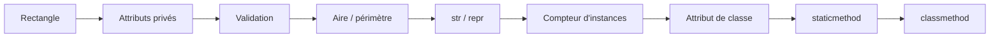

# Python - Classes avancées

Ce dossier développe progressivement une classe `Rectangle` pour approfondir l'encapsulation, les propriétés, les méthodes d'instance et de classe, les méthodes statiques et les méthodes spéciales de Python.

## Objectifs

- Encapsuler les attributs `width` et `height`.
- Valider les données avec des setters.
- Calculer l'aire et le périmètre d'un rectangle.
- Personnaliser les représentations `str()` et `repr()`.
- Suivre le nombre d'instances créées.
- Modifier un symbole d'affichage partagé par toutes les instances.
- Utiliser `@staticmethod` et `@classmethod`.

## Fichiers

| Fichier | Contenu |
| --- | --- |
| `0-rectangle.py` | Première définition de `Rectangle` |
| `1-rectangle.py` | Ajout de `width` et `height` avec validation |
| `2-rectangle.py` | Méthodes `area()` et `perimeter()` |
| `3-rectangle.py` | Représentation textuelle du rectangle |
| `4-rectangle.py` | Représentation reproductible avec `repr()` |
| `5-rectangle.py` | Gestion de la suppression d'une instance |
| `6-rectangle.py` | Compteur de rectangles instanciés |
| `7-rectangle.py` | Symbole d'affichage configurable |
| `8-rectangle.py` | Comparaison de rectangles via une méthode statique |
| `9-rectangle.py` | Création d'un carré via une méthode de classe |

## Progression



## Exécution

```bash
python3 0-main.py
```

## Technologies

- Python 3
- Programmation orientée objet
- Méthodes spéciales
- Méthodes statiques et méthodes de classe
