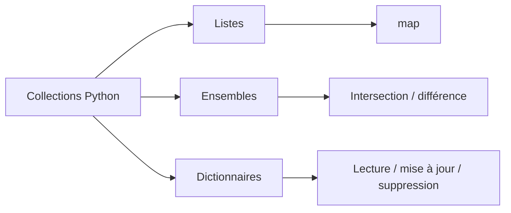

# Python - Structures de données avancées

Ce dossier approfondit la manipulation des listes, ensembles et dictionnaires en Python. Les exercices introduisent également `map()` et une conversion de nombres romains.

## Objectifs

- Transformer des matrices et listes.
- Utiliser les ensembles pour les opérations d'union, d'intersection et de différence.
- Manipuler des dictionnaires : lecture, tri, mise à jour et suppression.
- Construire de nouveaux dictionnaires à partir de données existantes.
- Utiliser `map()` pour transformer une séquence.
- Traduire une représentation en chiffres romains vers un entier.

## Fichiers

| Fichier | Contenu |
| --- | --- |
| `0-square_matrix_simple.py` | Création d'une nouvelle matrice contenant les carrés des valeurs |
| `1-search_replace.py` | Recherche et remplacement dans une liste |
| `2-uniq_add.py` | Somme des valeurs uniques d'une liste |
| `3-common_elements.py` | Intersection de deux ensembles |
| `4-only_diff_elements.py` | Différence symétrique entre deux ensembles |
| `5-number_keys.py` | Comptage des clés d'un dictionnaire |
| `6-print_sorted_dictionary.py` | Affichage d'un dictionnaire trié par clés |
| `7-update_dictionary.py` | Ajout ou mise à jour d'une paire clé/valeur |
| `8-simple_delete.py` | Suppression d'une clé |
| `9-multiply_by_2.py` | Création d'un dictionnaire dont les valeurs sont multipliées par deux |
| `10-best_score.py` | Recherche de la clé associée au meilleur score |
| `11-multiply_list_map.py` | Multiplication d'une liste avec `map()` |
| `12-roman_to_int.py` | Conversion d'un nombre romain en entier |

## Concepts abordés



## Exécution

```bash
python3 0-main.py
```

## Technologies

- Python 3
- Listes, sets et dictionnaires
- Compréhensions et `map()`
