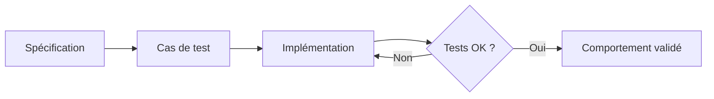

# Python - Test Driven Development

Ce dossier regroupe des exercices conçus autour de fonctions dont le comportement doit être précisément défini et vérifié. Ils mettent l'accent sur la validation des entrées, les cas limites, les exceptions et la documentation testable.

## Objectifs

- Définir clairement le contrat d'une fonction.
- Valider les types et valeurs reçus en arguments.
- Lever des exceptions adaptées en cas d'entrée invalide.
- Tester les cas nominaux et les cas limites.
- Documenter le comportement attendu des fonctions.
- Concevoir du code prévisible et facilement testable.

## Fichiers

| Fichier | Contenu |
| --- | --- |
| `0-add_integer.py` | Addition de deux nombres avec validation et conversion |
| `2-matrix_divided.py` | Division des éléments d'une matrice avec contrôles de structure et de type |
| `3-say_my_name.py` | Construction d'un affichage à partir de prénom et nom validés |
| `4-print_square.py` | Affichage d'un carré de caractères avec validation de taille |
| `5-text_indentation.py` | Mise en forme d'un texte selon sa ponctuation |
| `tests/` | Tests associés aux comportements attendus |

## Logique TDD



## Exécution

Selon le fichier de test utilisé :

```bash
python3 -m doctest -v tests/*.txt
```

ou avec les scripts de test Python présents dans le projet.

## Technologies

- Python 3
- Validation d'arguments
- Exceptions
- Tests et documentation
